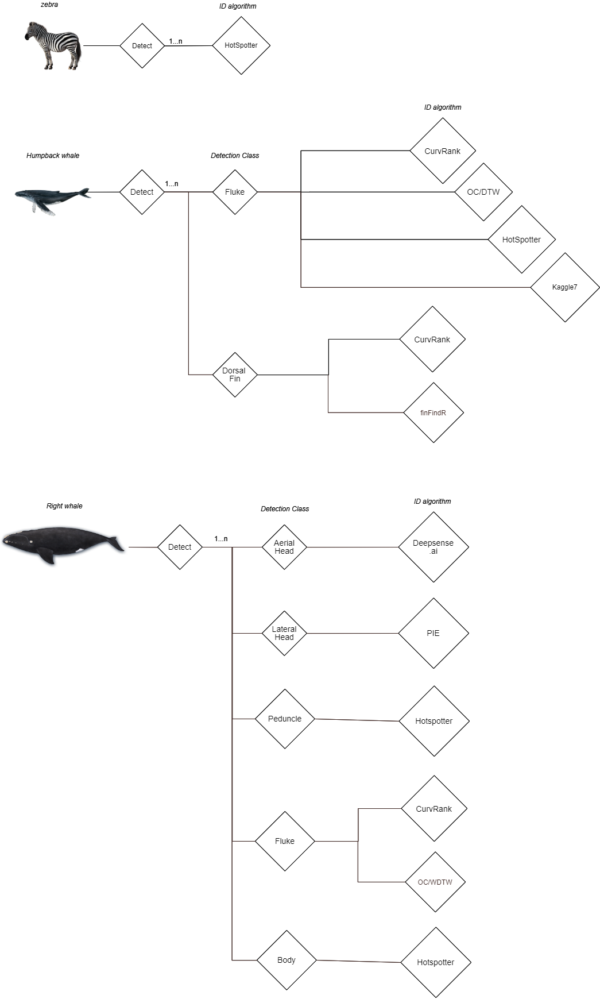
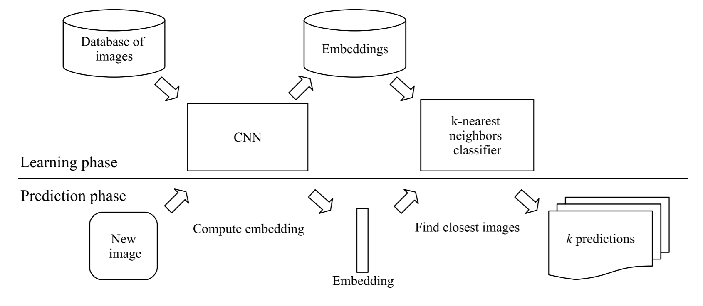
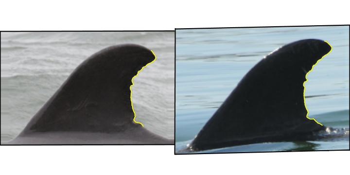
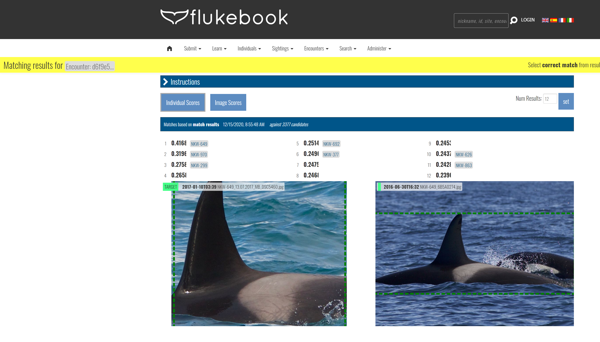

As the price of photography and video equipment drops and quality and availability improve (think “GoPro”), images and video from tourism are becoming the most abundant and inexpensive sources of wildlife data. If these images could be widely obtained, rapidly analyzed and combined with related data (e.g. location, date, behavior), then ecologists could benefit from larger and broader data sets to understand and prevent further wildlife population declines. An increase in well managed data input and processing power enables advances in analysis and modeling of animal populations, supporting deeper insight and better methods of protection for threatened and endangered animals.

In support of speeding and scaling wildlife research, Wildbook includes a very sophisticated machine learning (ML) server called [Wildbook Image Analysis (WBIA)](../developers/wbia/wbia_overview). WBIA provides a multi-stage pipeline for finding one or more animals of one or more species in photos and then routing each detected animal on to the correct individual ID algorithm. WBIA also supports a plug-and-play approach to integrating and wrapping third party machine learning (e.g., new ID algorithms emerging from academic research or competitions), allowing it to serve as the easiest and fastest way to get new AI techniques into the hands of wildlife researchers in the field. Ultimately, the purpose of WBIA is to allow users of Wildbook to more rapidly curate large volumes of wildlife photography in support of research and population analysis.

WBIA generally supports the following stages of execution:

## Detection

Our detection pipeline is a cascade of deep convolutional neural networks (DCNNs) that applies a fully-connected classifier on extracted features. Separate DCNN networks produce:
- Whole-scene classifications looking for specific species of animals in the photograph
- Object annotation bounding box localizations (also called "Annotations")
- Bounding box rotation prediction and normalization
- The viewpoint, quality, and final species classifications for the candidate bounding boxes

*A poster presentation summarizing some of the stages of WBIA's detection pipeline.*

At the end of the detection stage, WBIA should have created the following in preparation for one or more downstream individual ID algorithms:

- Annotations (i.e. bounding boxes) around each animal in each photo and potentially "parts" bounding boxes, such as a fin bounding box "part" on an Orca body bounding box
- Species labels on each Annotation. This label may also be referred to to as "iaClass" or "Image Analysis Class" elsewhere in Wildbook. It represents the type of the Annotation box. 
- Viewpoint labels (e.g. left, right, top, bottom, etc..) on each Annotation
- OPTIONAL: Background segmentation on each Annotation to remove as many non-animal pixels as possible
- OPTIONAL: Rotational correction, standardizing the rotation of Annotations to maximize their comparability in downstream ID algorithms. [More information about the Orientation network can be found here.](https://github.com/WildMeOrg/wbia-plugin-orientation/tree/develop/wbia_orientation)
- OPTIONAL: Parts to bodies assignment, allowing "parts" (e.g., an African wild dog tail) to be assigned to parents Annotations (e.g., the dog's body) in complex, multi-individual photos. [More information about the Assigner network can be found here.](https://community.wildme.org/t/the-assigner-building-an-ml-component-start-to-finish/596)

*Resulting bounding boxes predicted by WBIA's detection pipeline after running a photo of three cheetahs.*

### FAQ

*Can WBIA detect and label any species?*

WBIA is not originally programmed to detect every and all species. Detection relies on pre-trained ML models, which may be trained on one or more specific species (e.g., a model for snow leopards, a separate model for orcas, and a separate model trained on multiple species of finned whales). WBIA provides the tools to manually annotate training data for new species to create these ML models, but this must be done as a pre-cursor to using WBIA for a specific species in Wildbook.

*What does manual annotation look like for ML training for a detector for a new species?*

Here is a link to an [example training video](https://youtu.be/qD7LKWQIfeM) for annotation for a new species.

*What happens if detection doesn't find one or more animals in the photo?*

Even machine learning makes mistakes. If detection doesn't find an animal, Wildbook allows users to manually annotate the photo to add Annotations and support matching of individuals missed by detection. [Click here to learn more.](manual_annotation.md)

*I am a software developer of ML engineer. How can I learn more about WBIA?*

See [Wildbook Image Analysis (WBIA)](../developers/wbia/wbia_overview).

## Identification
The second major computer vision step is identification, which assigns a name label (or ID) to each annotation from the detection stage. Depending on the type of detection (e.g. a dolphin fin is labeled differently from a jaguar flank), the Wildbook pipeline routes the annotation to one or more suitable ID algorithms.

*Wildbook has a plug-and-play, configurable computer vision pipeline that allows annotations for different species and of body parts to be simultaneously routed to one or more ID algorithms.*

After detection, one or more ID algorithms are run, looking for similar features between a new annotation and a list of "match against" annotations already in the database. Scores from the query that match the same individual are accumulated to produce a single potential score for each animal. The animals in the database are then ranked by their accumulated scores.

*Wildbook uses a variety of computer vision and machine learning techniques and algorithms to answer the fundamental question: "Which animal is this?"*

Wildbook currently supports at least the following algorithms:

### PIE

Pose Invariant Embeddings or (PIE) is a deep learning approach to individual ID. PIE is trained to learn embeddings that are useful for distinguishing among individuals in a wildlife population. Unlike HotSpotter, which is a “static” pattern matcher (i.e. a fixed algorithm not trained to detect separate species), PIE can be trained on a per-species basis. Wild Me has generated separate PIE models optimized for manta rays, humpback whales, orcas, right whales, among others. Unlike fixed-catalog classifiers like Deepsense or Kaggle7, PIE can gracefully add new individuals to its catalog without being retrained. It learns the general task of mapping images into embeddings that represent individuals, rather than the specific task of sorting images into a fixed number of IDs. PIE strikes a lovely balance between a flexible, general-purpose identifier and one that can be trained, refocused, and refined on a given problem. In summary, PIE is a very powerful, reusable machine learning technique that can be trained to identify individuals across a variety of species.

Example Wildbook Species: Giant manta rays, humpback whale flukes, orcas, right whales

PIE Paper Link: https://arxiv.org/pdf/1902.10847.pdf

### Hotspotter

Hotspotter is a SIFT-based computer vision algorithm. It analyzes the textures in an image to find distinct patterning, or "hot spots", and then compares those against other images in the database. Unlike machine learning-based approaches, HotSpotter can help build new catalogs for new species that need to match individuals but don’t have the training data yet for machine learning-based approaches. Hotspotter can also match new individuals without the need for network retraining. Hotspotter produces a ranked list of potential matches, increasing match score in congruence with increasing "hot spot" similarity.

Example Wildbook Species: jaguars, cheetahs, leopards, African wild dogs, zebras, giraffe, humpback whales

Hotspotter Paper Link: http://cs.rpi.edu/hotspotter/crall-hotspotter-wacv-2013.pdf	

### CurvRank v2

CurvRank is a machine learning-based approach to matching curvature or an "edge", such as the trailing edge of a cetacean fluke or a dorsal fin. More specifically, ML is employed to weight sections of a fin or fluke that contain individually identifying information and to represent the curvature in a comparable format less subject to deformation from changes in the pose of the animal in the image.

Example Wildbook Species: humpback whales, sperm whales, bottlenose dolphins, orcas, right whales, spinner dolphins, fin whales, and more

CurvRank Paper Link: https://openaccess.thecvf.com/content_ICCV_2017_workshops/papers/w41/Weideman_Integral_Curvature_Representation_ICCV_2017_paper.pdf

### finFindR

finFindR is a machine learning-based approach to matching curvature or an “edge”, such as the leading and trailing edges of a dorsal fin. More specifically, ML is employed to identify cetacean bodies and dorsal fins in an image, extra a fin edge, create a feature matrix representing that edge, and then compare that edge to others in the catalog.

Example Wildbook Species: bottlenose dolphins, orcas, fin whales, humpback whale dorsals

finFindR Paper Link: https://www.biorxiv.org/content/10.1101/825661v1

### Deepsense

Deepsense is a deep learning approach to identify right whales based on aerial photos of the callosity patterns on their heads. Deepsense is the winning entry from Kaggle competition winner [deepsense.ai](https://deepsense.ai). It is fast and incredibly accurate, however it must occasionally be re-trained when new whale individuals are added to a catalog. Like many deep learning competition winners, this algorithm is optimized for its specific task and cannot be cross-applied to other wildlife challenges. It is also highly subjective to the quality of the data in a right whales' catalog, with performance degrading significantly (due to machine-learned errors) if the catalog is not already well curated. 

Example Wildbook Species: right whales

Deepsense Paper Link: https://www.researchgate.net/publication/327910789_Applying_deep_learning_to_right_whale_photo_identification

### OC/WDTW

OC/WDTW (or “DTW” for short) is originally based on a soundwave matching technique called “Dynamic Time Warping”. DTW uses the A* algorithm to extract the trailing edge of a fluke and then search for matches to other edges by measuring the differences between them. This computer vision technique does not use ML and is optimized only for the trailing edge of humpback flukes but has great accuracy and speed.

Example Wildbook Species: humpback whales, sperm whales, right whales

OC/WDTW Link: https://openaccess.thecvf.com/content_ICCV_2017_workshops/papers/w41/Weideman_Integral_Curvature_Representation_ICCV_2017_paper.pdf

### Kaggle7

Kaggle7 is a deep learning approach to identifying individual humpback whale flukes based on one of the winning entries from a Kaggle competition. Kaggle7 is highly effective at identifying individual humpback whales by their natural fluke patterning. However, it must occasionally be re-trained when new whale individuals are added to a catalog. Like many deep learning competition winners, this algorithm is optimized for its specific task and cannot be cross-applied to other wildlife challenges. It is also highly subjective to the quality of the data in a humpback catalog, with performance degrading significantly (due to machine-learned errors) if the catalog is not already very well curated. 

Example Wildbook Species: humpback whales

Kaggle7 Link: https://medium.com/@ducha.aiki/thanks-radek-7th-place-solution-to-hwi-2019-competition-738624e4c885

### Modified Groth and I3S (Spot Pattern Matching)

The Modified Groth and I3S algorithms are used independently of the image analysis pipeline in Wildbooks that are focused on matching individuals using natural spot patterning on their flanks.

Example Wildbook Species: whale sharks, sevengill sharks, giant sea bass, and sand tiger/ragged tooth sharks

Modified Groth Link: https://besjournals.onlinelibrary.wiley.com/doi/full/10.1111/j.1365-2664.2005.01117.x

I3S Link: https://www.researchgate.net/publication/228007763_A_computer-aided_program_for_pattern-matching_of_natural_marks_on_the_spotted_raggedtooth_shark_Carcharias_taurus

## Consolidated Display

At the end of the identification process, Wildbook displays a ranked lists of results, displaying one set of results per feature (e.g., whale fluke) per algorithm (e.g., PIE). You can select and set a matching IDs right from the review interface, which displays 12 ranked matched results (#1 is the predicted best match) but can display more than 12 if desired.

*An orca is matched by the machine learning-based PIE algorithm using the scratches on its "saddle patch".*
