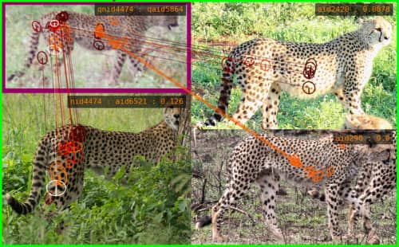

## Detection
Our detection pipeline is a cascade of deep convolutional neural networks (DCNNs) that applies a fully-connected classifier on extracted features. Three separate networks produce: (1) whole-scene classifications looking for specific species of animals in the photograph, (2) object annotation bounding box localizations, and (3) the viewpoint, quality, and final species classifications for the candidate bounding boxes.

## Identification
The second major computer vision step is identification, which assigns a name label to each annotation from detection. To do this, SIFT (scale-invariant feature transform) descriptors are first extracted and then compared at keypoint locations. Scores from the query that match the same individual are accumulated to produce a single potential score for each animal. The animals in the database are then ranked by their accumulated scores. A post-processing step spatially verifies the descriptor matches and then re-scores and re-ranks the database individuals.

*Example correct identifications. The upper left annotation in each frame is the annotation to be identified. The other frames are the other annotations for the same animal. The bottom left annotation is the primary matching frame. The colored line segments show connections between corresponding features of the same animal.*

## Analysis 
The results of computer vision are returned to Wildbook’s data management software, which supports rapid curation, export, and analysis. Data can be rapidly viewed in tables, maps, charts, calendars, and as thumbnails. Data can also be searched, filtered, and used in R, Mark, ArcGIS, Google Earth, and other applications.

