This documentation presents the full procedure on how to use the WBIA toolkit to analyze photographic censusing rallies, using the Great Grevy's Rally (GGR) as the prototype.

## Overview of the Great Grevy's Rally

The Great Grevy's Rally (GGR) is a large-scale photographic census of the entire Grevy's zebra population in Kenya.  The current GGR process is an improved successor to the prototype process established during the Great Zebra and Giraffe Count (GZGC) from "Photographic censusing of zebra and giraffe in the Nairobi National Park" by Dr. Jason Parham.  The GZGC was held March 1-2, 2015 at the Nairobi National Park in Nairobi, Kenya, and was organized to estimate the resident populations of Masai giraffes (*Giraffa camelopardalis tippelskirchi*) and Plains zebras (*Equus quagga*) within the park.

In contrast, the GGR was first held on January 30-31, 2016 in the Laikipia region of central and northern Kenya, covering the known range of Grevy's zebra within the country.  The GGR was repeated on January 27-28, 2018 for the same survey area and added a second census on reticulated giraffes (*Giraffa reticulata*).  A third census was also completed in early 2020 but has yet to be processed.  The map below provides a map of Kenya and the respective survey areas for each of the three censusing rallies.  We can see that the area covered by the GGR events is much larger than the GZGC, incorporates the conservation areas of multiple Kenyan counties, and is concerned with an open animal population.

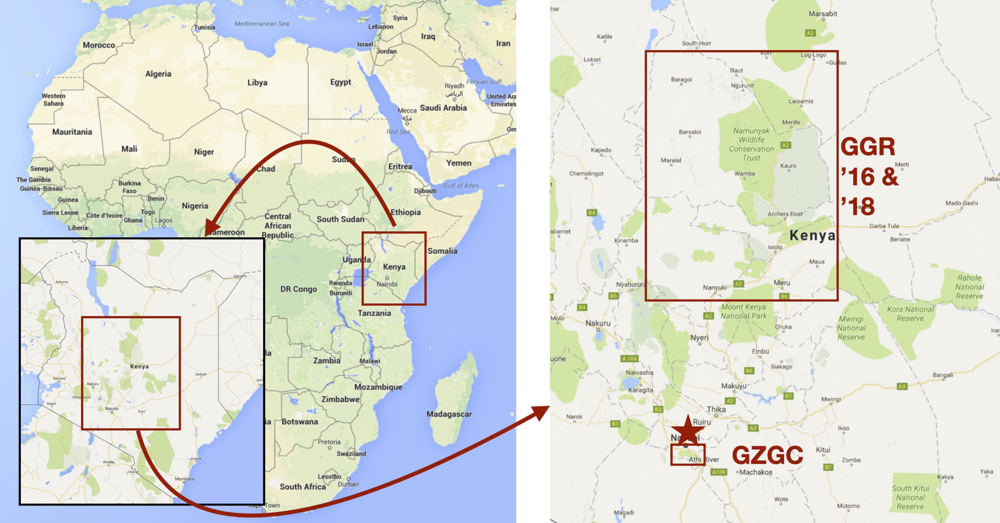

### Overview of Analysis

Both Great Grevy's Rally censusing events followed the same procedure, presented as a complete process flow diagram in the below process diagram.  One of the primary benefits is that all of the machine learning components can be bootstrapped as the analysis proceeds with the help of human annotators.  This design is crucial as ready-to-go, pre-existing machine learning models are not available for most endangered species. Furthermore, once the machine learning components are successfully trained, they can be reused for future events with the same collection procedure and species of interest.

The entire GGR workflow goes beyond the above processing chart because it does not include details on the data collection.  For example, images must be collected from citizen scientists and are then aggregated and synchronized for accurate GPS and time metadata.  There is a large discussion on how to properly organize and incentivize a large-scale data collection with volunteers, which can be found in "Animal Detection for Photographic Censusing" by Dr. Jason Parham.


Prior to using this document, the reader is suggested to already be familiar with the [overview of the WBIA software](developers/wbia/wbia_overview.md) and [its plug-ins](developers/wbia/wbia_plugins.md) prior to reading and using this documentation.

*The above introduction and some of the content of this page have been adapted from the dissertation "Animal Detection for Photographic Censusing" by Dr. Jason Parham, the original author of this content.*

### TL;DR

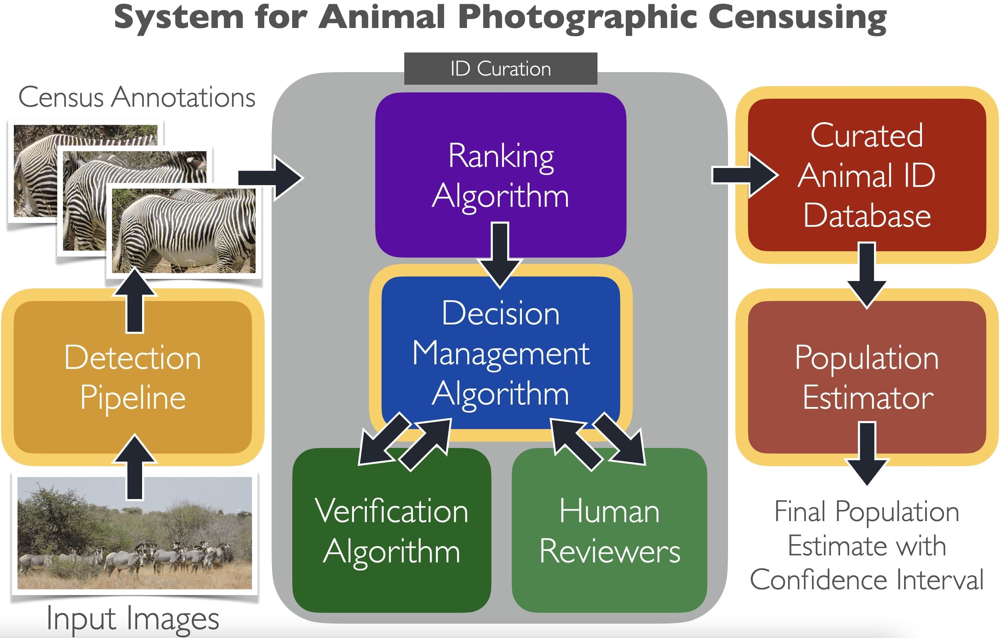

Above is a diagram of the general process, from image importing, to curation, to a final population estimate.

## Creating a WBIA Database

Before we begin talking about the GGR procedure, we must first talk about how the data should be stored and how the associated GGR-specific routines will access it from a WBIA database.  A WBIA database, at its core, is simply a special folder on the local file system. WBIA uses SQLite3 and subfolders for all of its database and asset storage, and can be reviewed here: [overview of the WBIA software](developers/wbia/wbia_overview.md).  When a WBIA database is loaded into a controller object, it is accessed using a Python API.

### Starting a WBIA Docker container

The easiest way to open a WBIA database is to use Docker, with the following commands:

```bash
# Install tmux (or screen)
sudo apt install tmux

# Create a holding folder
cd ~/
mkdir -p $(pwd)/wbia
cd $(pwd)/wbia

# copy raw GGR data into $(pwd)/wbia/import/

# Setup environment file for permissions
echo """
HOST_UID=$(id -u)
HOST_USER=$(whoami)
""" > $(pwd)/wbia.env

# Launch Docker container
docker run \
    -d \
    -p 5000:5000 \
    --gpus '"device=0,1"' \
    --shm-size=2g \
    --name wbia.ggr \
    -v $(pwd)/db:/data/db \
    -v $(pwd)/cache:/cache \
    -v $(pwd)/import:/data/import \
    --env-file $(pwd)/wbia.env \
    --restart unless-stopped \
    wildme/wbia:develop \
        --container-name wbia.ggr \
        --lca \
        --engine-slow-lane-workers 0 \
        --engine-fast-lane-workers 0

# Docker container logging
docker logs --follow wbia.ggr

# iPython embed interactive session inside Docker container
tmux new-session -s wbia.ggr

# Exec into the Docker container and start bash
<tmux>$ docker exec -it wbia.ggr bash

# Load the WBIA database
<container>$ embed
```

The above `embed` command will place you into an iPython shell with a WBIA controller `ibs` already loaded in the local variable space and attached to the database `/data/db` within the Docker container.

### Making a WBIA controller

Alternatively, the WBIA controller can be loaded from source by running the code below:

``` python
import wbia

ibs = wbia.opendb('/path/to/database')
```

## Image Ingestion

The importing of images for GGR is similar to importing data for any standard use within WBIA, except for one major distinction: the images are associated with their car, photograher, and day of capture on import.  The images are associated with named imagesets as ``<Event>,<Car Number>,<Photographer Letter>`` for who took the picture and are individually labeled on import as ``<Event>,<Car Number>,<Photographer Letter>,<Photograph Index>``.  For example, the function ``ibs.parse_ggr_name()`` takes an imageset name and parses out the three critical pieces of information of event, person letter, and car number.

### Adding images to a WBIA database

All of the GGR scripts in the following sections will rely on having access to a WBIA controller object `ibs` and a database of images and annotations.  The controller offers all of the standard CRUD modules to add, get, set, and delete objects within the database.  The images can be added manually with Python or REST APIs, and the WBIA web interface can be used to annotate ground-truth bounding boxes.  Newly created annotations can also be added manually with Python or REST APIs, in addition to the web interface.  There are also additional web interfaces for reviewing annotations and adding relevant metadata for species, viewpoints, and other ground-truth attributes needed for animal ID.  To do this manually, for example, you can use the following code:


CVS: This next snippet of code needs more explanation on what is assumed / produced at each step.

``` python
import wbia
from wbia.detecttools.directory import Directory

IMPORT_PATH = '/data/import'

gid_list = ibs.import_folder(IMPORT_PATH)

direct = Directory(IMPORT_PATH, recursive=True, images=True)
filepaths = list(direct.files())

gids = ibs.get_valid_gids()
processed = set(ibs.get_image_uris_original(gids))

filepaths_ = sorted(list(set(filepaths) - processed))
chunks = ut.ichunks(filepaths_, 128)

for filepath_chunk in tqdm.tqdm(chunks):
    try:
        ibs.add_images(filepath_chunk)
    except Exception:
        pass

gid_list = ibs.get_valid_gids()
```

To add images to a database in bulk from a folder, there is a handy function on the IBEIS controller that will recursively search a folder for new images and add them to the database.

``` python
# The path is the location within the Docker container, which is mapped to a
# host folder on launch
gids = ibs.import_folder('/data/import')

# Get the original paths of the images that were imported
image_paths = ibs.get_image_uris_original(gids)
```

Specifically for the GGR events, there is additional metadata that is stored on the images as notes.  The metadata come from the directory structure of the images, which need to be organized and standardized prior to import.  This process can be painful and slow, and often requires a lot of manual renaming and re-organizing.  For the GGR 2018, as an example, the process included merging multiple folders into a single collection, renaming folders to have the proper naming convention, and other parsing fixes.  The function ``ibs.convert_ggr2018_to_wbia()`` located in ``wbia/dbio/ingest_ggr.py`` is an example of the type clean up that should be performed on image ingestion.

With the data imported into a WBIA database, there are GGR-specific functions that WBIA offers to query images within a certain date range, like ``ibs.query_ggr_gids_between_dates()``.

### "3-2-1 Snap!" Synchronization

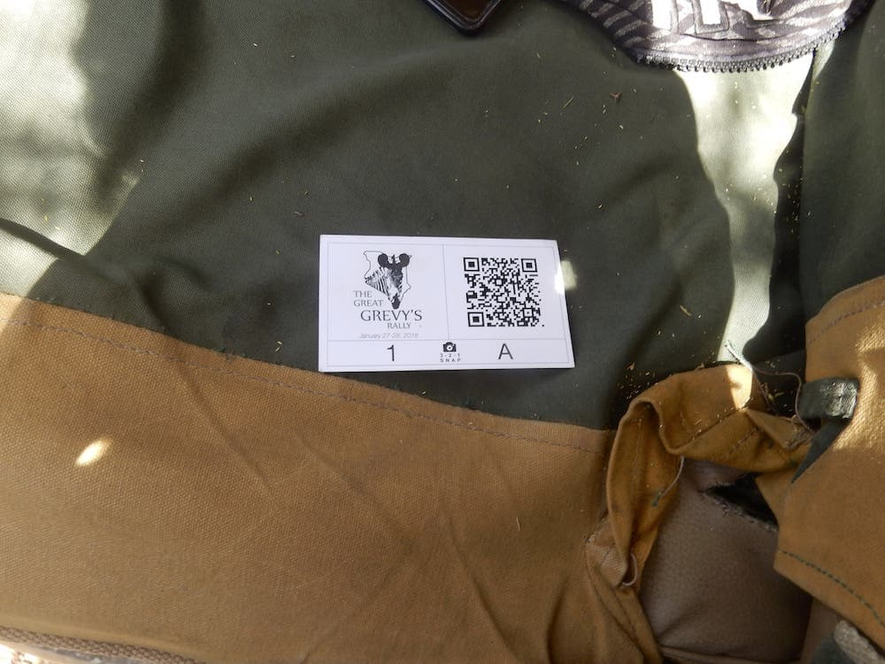

Once all of the images have been imported into a WBIA dataset, the next step is to synchromize the times of the photographs taken by any non-GPS cameras.  To facilitate this, each GPS camera that wis provided by the GGR event organizers is given the Camera Card Letter A for each vehicle.  The other cameras in the vehicle must be synchronized to this camera's timestamps.  To allow for this, each participant is instructed to take a synchronized photograph of their card "3-2-1 Snap!".  The card displays a QR code that has very basic information on the car number, the person's letter code, the event name, and the day (1 or 2).  Here is an example from one card:

    http://www.greatgrevysrally.com/?car=73&person=a&event=ggr2020&day=1

The QR codes must be found for each participant in their collected images.  Once the synchronization photo is found for each participant, the time offsets for each photo can be calculated for each participant separately.  The assumption is that the camera for each participant is accurately keeping time, but is not precisely synchronized to the local Kenya time.  The following WBIA functions can be used to fix QR code issues, search for their images within a set of photos, inspect them for accuracy, and process the time synchronization:

CVS: The description of what's being fixed here is vague. Elaborate and provide pointers to python files

*  ``ibs.fix_ggr_qr_codes()``
*  ``ibs.search_ggr_qr_codes()``
*  ``ibs.inspect_ggr_qr_codes()``
*  ``ibs.sync_ggr_with_qr_codes()``

### Time & GPS Metadata Reconciliation

To synchronize the GPS and time metadata for any non-A cameras, use the following functions:

CVS: Need a bit more detail here as well.

```python
ibs.commit_ggr_fix_gps(min_diff=600, individual=False)
ibs.overwrite_ggr_unixtimes_from_gps()
```

To then delete any images taken outside of the time bounds of the event:

CVS: people will wonder how the bounds are determine

```python
ibs.purge_ggr_unixtime_out_of_bounds()
```

### Kenyan Counties and Land Regions

The Kenyan counties and land regions are coded into the WBIA repository and can be created as imagesets.  The coordinates of the counties themselves are encoded as a shape file, which is downloaded from an external CDN if needed.  The outline paths can be extracted and given with the following function

CVS: please add the location (URL) of the CDN

```python
ibs.compute_ggr_path_dict()
```

When the images are added to the database, you can use the following code to assign images to their respective regions (which may overlap):

``` python
ibs.compute_ggr_imagesets()
ibs.delete_empty_imgsetids()
ibs.update_imageset_info(ibs.get_valid_imgsetids())
```

## Detection Curation

New Grevy's zebra and reticulated giraffe localization models were explicitly trained for the GGR-18, ignoring pre-existing models from the GGR-16 and GZGC.  These models were re-trained due to training process improvements (i.e., an updated Python implementation) and used annotations generated by a more robust bounding box collection methodology.  A total of 5,000 images were annotated for the GGR-18, with at least three independent reviewers for each image.  A pool of 14 reviewers was asked to annotate bounding boxes for 10% of the dataset during the GGR-18.  The triple-reviewer procedure was not used with the GZGC or GGR-16 events for two reasons:

1.  in the interest of time, the reviewers' workload was limited to one review per image (and done by hand for all images), and
2.  the analysis of the GGR-18 data included the AoI component, which required more reliable and robust ground-truth annotations.

Since each image was annotated slightly differently by three individuals (and since AoI decisions are somewhat subjective), these bounding box candidates needed to be merged (or "married") into a set of finalized bounding box candidates.  A greedy three-person marriage algorithm compared the bounding boxes across the three reviewers, prioritizing the merging of boxes with the highest joint Intersection Over Union (IoU) percentages and starting with groups of three highly overlapping boxes (one from each reviewer).  This process continued until a threshold was met (IoU 25%).  After all three-box marriages were assigned, a second round of two-box marriages was performed.  Furthermore, AoI flags were determined independently for each annotation before the marriage assignments.  These flags are vital to properly tune the localization models to de-prioritize background animals.

### Ground Truth Review

For all future events, it is recommended to use the pre-trained models for all localization, labeling, and background masking.  However, if a researcher wished to train new models, the following procedure and interfaces may be used.  The first step is to annotate ground-truth bounding boxes and metadata.  This can be done by reviewing up to a certain percentage of the entire dataset (e.g., 10%) and then training the model on this subset.  These interfaces are all available at this overview ``/review/``.

CVS: These aren't live! Also, I want to see how you would analyze the manual annotations vs. detection results.

CVS: Please add a very brief review of the pipeline stages --- one sentence each about what's computed.

**Bounding Boxes**

    /review/detection/

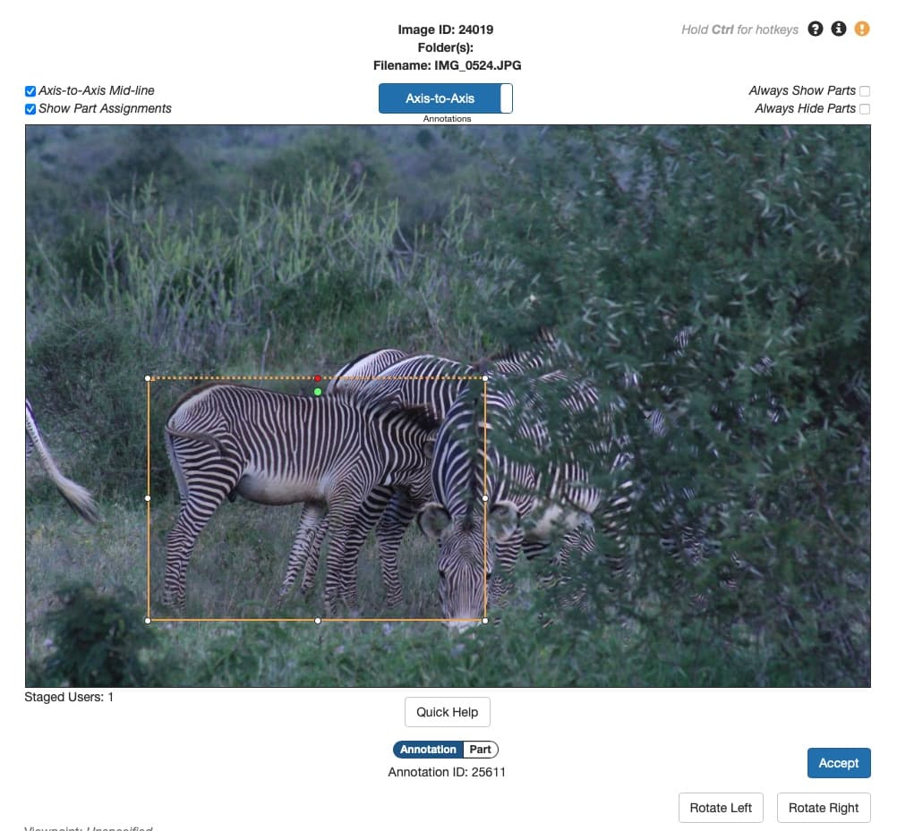

**Species**

    /review/species/

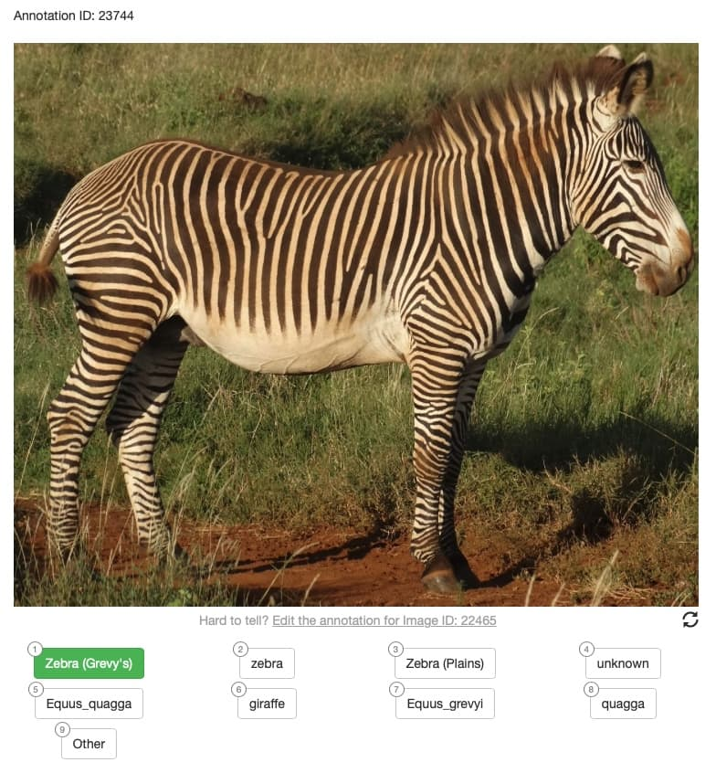

**Viewpoints**

    /review/annotation/layout/


**Census Annotation**

    /review/annotation/canonical/

    # Unlabeled
    /review/annotation/canonical/?version=1

    # Negative
    /review/annotation/canonical/?version=2

    # (Positive
    /review/annotation/canonical/?version=3

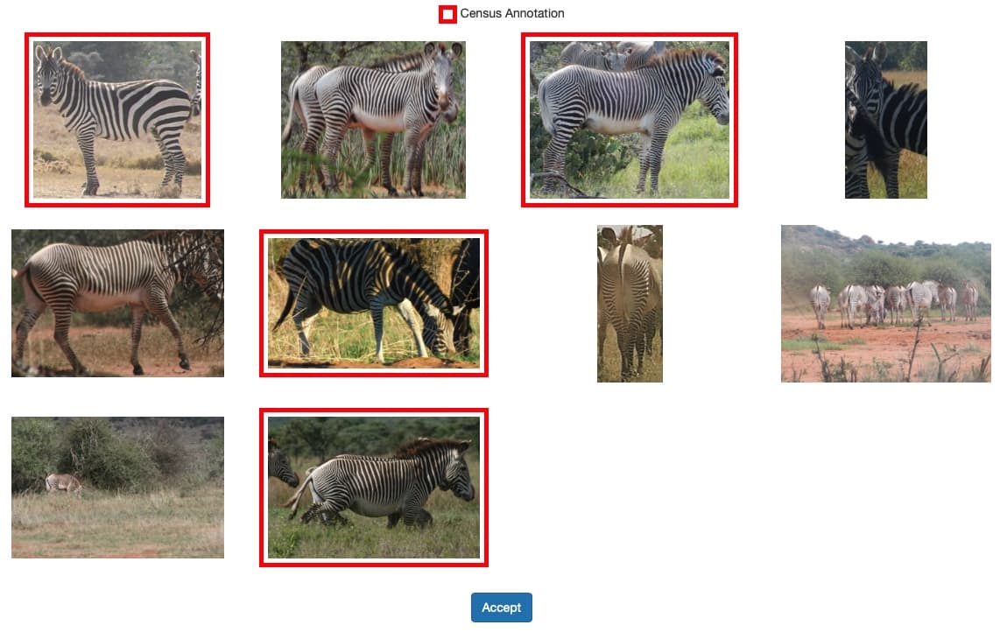

CVS: You don't have anything here about AoI. I really believe CA can completely supercede AoI but I recall that you don't agree and have it kept. If I am right, please add.

**Census Annotation Regions**

To annotate Census Annotation Regions (CA-R), the user needs to add a part box within a Census Annotation (CA) annotation.  The distinction of a CA-R versus a different part is arbitrary, and the user may simply use a custom part type to designate the part is intended to be a CA-R.

    /review/detection/


**Thumbnail Caching**

To speed up the WBIA web interface for online reviews, run the following functions to pre-compute and cache their web-friendly image thumbnails.

*  ``ibs.precompute_web_detection_thumbnails()``
*  ``ibs.precompute_web_viewpoint_thumbnails()``

Once the ground-truth is annotated, you can use the [detector training instructions](developers/wbia/wbia_pipeline.md) to train and deploy new models.

### Making Train/Test Sets

Lastly, the dataset needs to be split between a training set and a testing set.  The split between train and test is automatically determined by taking each image in the entire dataset and splitting it randomly as 80% for training and 20% for testing.  The validation set is taken from the training set, as determined by each component individually.  Running the following Python code will create the initial split and add the images into two imagesets called `TRAIN_SET` and `TEST_SET`:

CVS: I assume I can substitute a different procedure for this.  I'd like to group into occurrences and ensure each occurrence is only in TRAIN or TEST (probably should explicit add VAL)

``` python
ibs.imageset_train_test_split()
```

### Annotation Localization

To apply the pre-trained annotation localizer to the images, use the following code.  The recommended localization model for GGR events with Grevy's zebra is the ``ggr2`` model using the ``lightnet`` algorithm backbone.  The NMS thresholds have been selected to optimize for AoI detection.

CVS: AoI or CA?


```python
gid_list = ibs.get_valid_gids()

# Run the localizer
config = {
    'algo'           : 'lightnet',
    'config_filepath': 'ggr2',
    'weight_filepath': 'ggr2',
    'sensitivity'    : 0.4,
    'nms'            : True,
    'nms_thresh'     : 0.4,
}
results_list = ibs.depc_image.get_property(
    'localizations',
    gid_list,
    None,
    config=config
)

# Commit the localization results to the database
aids_list = ibs.commit_localization_results(
    gid_list,
    results_list
)
aid_list = ut.flatten(aids_list)
```

### Annotation Classification

To apply the annotation classifier (labeler) to the detections, use the following code.  The recommended labeler model for GGR events with Grevy's zebra is the ``zebra_v1`` model.

CVS: Here you use densenet, but earlier you have lightnet. Please be clear on the choice and distinction.

```python
# Filter to focus only on zebra annotations (e.g., ignoring giraffes)
species_list = ibs.get_annot_species(aid_list)
flag_list = ['zebra' in species for species in species_list]
aid_list_ = ut.compress(aid_list, flag_list)

# Run labeler
config = {
    'labeler_algo': 'densenet',
    'labeler_weight_filepath': 'zebra_v1',
}
result_list = ibs.depc_annot.get_property(
    'labeler',
    aid_list_,
    None,
    config=config
)

# Update database with species and viewpoints
species_list = ut.take_column(result_list, 1)
viewpoint_list = ut.take_column(result_list, 2)
ibs.set_annot_species(aid_list_, species_list)
ibs.set_annot_viewpoints(aid_list_, viewpoint_list)
```

### Census Annotation (CA)

Once Grevy's zebra annotations have been created and labeled with a viewpoint, we can use the Census Annotation (CA) classifier to distinguish the annotations that should be used during the ID analysis.

```python
aid_list = ibs.get_valid_aids()
species_list = ibs.get_annot_species(aid_list)
viewpoint_list = ibs.get_annot_viewpoints(aid_list)
aids = [
    aid
    for aid, species, viewpoint in zip(aid_list, species_list, viewpoint_list)
    if species == 'zebra_grevys' and 'right' in viewpoint
]
filtered_aids = aids[:]
filtered_gids = list(set(ibs.get_annot_gids(filtered_aids)))

config = {'classifier_algo': 'densenet', 'classifier_weight_filepath': 'canonical_zebra_grevys_v4'}
prediction_list = ibs.depc_annot.get_property('classifier', aids, 'class', config=config)
confidence_list = ibs.depc_annot.get_property('classifier', aids, 'score', config=config)
confidence_list = [
    confidence if prediction == 'positive' else 1.0 - confidence
    for prediction, confidence in zip(prediction_list, confidence_list)
]
flag_list = [confidence >= 0.31 for confidence in confidence_list]

ca_aids = ut.compress(aids, flag_list)
conf_list = ut.compress(confidence_list, flag_list)
ca_gids = list(set(ibs.get_annot_gids(ca_aids)))
```

### Census Annotation Regions (CA-R)

If an annotation is marked as a Census Annotation, this implies that it must have a Census Annotation Region as well.  We filter down to CA bounding boxes and then run a dedicated network to predict the axis-aligned region within it.

```python
def _convert(bbox, aid):
    import numpy as np
    xtl, ytl, w, h = ibs.get_annot_bboxes(aid)
    x0, y0, x1, y1 = bbox
    x0 = int(np.around(x0 * w))
    y0 = int(np.around(y0 * h))
    x1 = int(np.around(x1 * w))
    y1 = int(np.around(y1 * h))
    xtl += x0
    ytl += y0
    w -= x0 + x1
    h -= y0 + y1
    bbox = (xtl, ytl, w, h)
    return bbox
globals().update(locals())

config = {
    'canonical_weight_filepath': 'canonical_zebra_grevys_v4',
}
prediction_list = ibs.depc_annot.get_property('canonical', ca_aids, None, config=config)
bbox_list = [_convert(prediction, aid) for prediction, aid in zip(prediction_list, ca_aids)]

gid_list = ibs.get_annot_gids(ca_aids)
viewpoint_list = ibs.get_annot_viewpoints(ca_aids)
species_list = ['zebra_grevys+_canonical_'] * len(ca_aids)

car_aids = ibs.add_annots(
    gid_list,
    bbox_list,
    species_list=species_list,
)
ibs.set_annot_viewpoints(car_aids, viewpoint_list)
ibs.set_annot_detect_confidence(car_aids, conf_list)
```

### Deduplicate CA-Rs

Once all of the Census Annotation Regions have been created for all images, we next need to de-duplicate them to ensure that no image with mutliple CA-Rs overlap.  We wish to eliminate any ambiguity during ID processing.

CVS: It would help to briefly explain why de-dup is needed.

```python
all_aids = ibs.get_valid_aids()
species = ibs.get_annot_species(all_aids)
flags = [val != 'zebra_grevys+_canonical_' for val in species]
delete_aids = ut.compress(all_aids, flags)
ibs.delete_annots(delete_aids)

# De-duplicate
aids = ibs.get_valid_aids()
gids = ibs.get_annot_gids(aids)
gid_map = {}
for gid, aid in zip(gids, aids):
    if gid not in gid_map:
        gid_map[gid] = []
    gid_map[gid].append(aid)

keep_aids = []
for gid in tqdm.tqdm(gid_map):
    aids = sorted(set(gid_map[gid]))
    keep_aids += ibs.nms_aids(aids, nms_thresh=1.0)

delete_aids = list(set(all_aids) - set(keep_aids))
ibs.delete_annots(delete_aids)

aids = ibs.get_valid_aids()
gids = ibs.get_annot_gids(aids)
ut.dict_hist(ut.dict_hist(gids).values())

all_gids = ibs.get_valid_gids()
delete_gids = list(set(all_gids) - set(gids))
ibs.delete_images(delete_gids, trash_images=False)
```

CVS: Why delete the images here without checking to see if the image did not have any aids remaining?  This check is applied elsewhere.  Also the ut.dict_hist results near the end of the code are not used.

CVS: Throughout this there is an understanding that we are whittling down the aids and gids to only CA's and only images that have at least one CA. Please make an explicit discussion of this

CVS: I didn't see the code snippets for some things:  WIC, orientation, quality, etc.

### Qualitative Filtering

Beyond the automated classifiers, we further filter out any annotation that fails to pass a series of qualitative heuristics, including: aspect ratio checks, annotations where the width or height are too small, and a minimum gradient magnitude.

```python
def gradient_magnitude(image_filepath):
    import numpy as np
    import cv2

    try:
        image = cv2.imread(image_filepath)
        image = image.astype(np.float32)

        sobelx = cv2.Sobel(image, cv2.CV_64F, 1, 0, ksize=3)
        sobely = cv2.Sobel(image, cv2.CV_64F, 0, 1, ksize=3)
        magnitude = np.sqrt(sobelx ** 2.0 + sobely ** 2.0)
    except Exception:
        magnitude = [-1.0]

    result = {
        'sum': np.sum(magnitude),
        'mean': np.mean(magnitude),
        'max': np.max(magnitude),
    }
    return result

aid_list = ibs.get_valid_aids()

bbox_list = ibs.get_annot_bboxes(aid_list)
aspect_list = [h / w for xtl, ytl, w, h in bbox_list]
aspect_thresh_mean = np.mean(aspect_list)
aspect_thresh_std = np.std(aspect_list)
aspect_thresh_min = aspect_thresh_mean - 2.0 * aspect_thresh_std
aspect_thresh_max = aspect_thresh_mean + 2.0 * aspect_thresh_std
globals().update(locals())
aspect_flag_list = [
    aspect_thresh_min <= aspect and aspect <= aspect_thresh_max
    for aspect in aspect_list
]
aspect_aid_list = ut.compress(aid_list, aspect_flag_list)

bbox_list = ibs.get_annot_bboxes(aspect_aid_list)
w_list = [w for xtl, ytl, w, h in bbox_list]
h_list = [h for xtl, ytl, w, h in bbox_list]
w_thresh_mean = np.mean(w_list)
w_thresh_std = np.std(w_list)
h_thresh_mean = np.mean(h_list)
h_thresh_std = np.std(h_list)
w_thresh = w_thresh_mean - 1.5 * w_thresh_std
h_thresh = h_thresh_mean - 1.5 * h_thresh_std
globals().update(locals())
w_h_flag_list = [
    w_thresh <= w and h_thresh <= h
    for w, h in zip(w_list, h_list)
]
w_h_aid_list = ut.compress(aspect_aid_list, w_h_flag_list)

chips_paths = ibs.get_annot_chip_fpath(w_h_aid_list)
arg_iter = list(zip(chips_paths))
gradient_dict_list = ut.util_parallel.generate2(
    gradient_magnitude, arg_iter, ordered=True
)
gradient_dict_list = list(gradient_dict_list)
gradient_mean_list = ut.take_column(gradient_dict_list, 'mean')
gradient_thresh_mean = np.mean(gradient_mean_list)
gradient_thresh_std = np.std(gradient_mean_list)
gradient_thresh = gradient_thresh_mean - 1.5 * gradient_thresh_std
globals().update(locals())
gradient_flag_list = [
    gradient_mean >= gradient_thresh for gradient_mean in gradient_mean_list
]
gradient_aid_list = ut.compress(w_h_aid_list, gradient_flag_list)


delete_aids = list(set(ibs.get_valid_aids()) - set(gradient_aid_list))
ibs.delete_annots(delete_aids)

gids = ibs.get_valid_gids()
aids = ibs.get_image_aids(gids)
lens = list(map(len, aids))
flags = [length == 0 for length in lens]
delete_gids = ut.compress(gids, flags)
ibs.delete_images(delete_gids, trash_images=False)
```

## ID Curation

### HotSpotter Ranking

The HotSpotter (HS) algorithm is called automatically when the GraphID and LCA algorithms are executed, but to get HS results directly you can use the code below:

```python
all_aid_list = ibs.get_valid_aids()
qaid_list = ibs.check_ggr_valid_aids(all_aid_list)
daid_list = qaid_list[:]

query_config_dict_list = [
    {'sv_on': True, 'fg_on': True, 'K': 5, 'Knorm': 3},
]

for query_config_dict in query_config_dict_list:
    for qaid in qaid_list:
        qaids = [qaid]
        daids = daid_list[:] + qaid_list[:]

        query_result = ibs.query_chips_graph(
            qaid_list=qaids,
            daid_list=daids,
            query_config_dict=query_config_dict,
            echo_query_params=False
        )
```

### VAMP Verifier

Similarly to HotSpotter, the VAMP algorithm is executed automatically by both the GraphID and LCA algorithms.  That being said, the HotSpotter algorithm does not need to be trained on new species whereas a new VAMP model does need to be trained.  To train VAMP, there needs to be pre-existing ID decisions within the WBIA database.  The algorithm may bootstrap its training data using the raw decisions or from an ID graph.

**Train & Deploy**

```python
import wbia
from wbia.algo.verif.vsone import OneVsOneProblem

aid_list = ibs.get_valid_aids()
aid_list = ibs.check_ggr_valid_aids(aid_list, species='zebra_grevys', threshold=0.75)

infr = wbia.AnnotInference(ibs=ibs, aids=aid_list)
infr.reset_feedback(apply=True)
infr.reset_feedback('staging', apply=True)

pblm = OneVsOneProblem(infr, sample_method='bootstrap')
pblm.deploy()
```

Next, upload the trained model to the CDN and modify the file ``wbia/algo/verif/deploy.py`` to add the new model and species configuration.

**Evaulate**

Once training is complete, the model can be evaulated with the following code:

```python
pblm.setup_evaluation(with_simple=False)
pblm.report_evaluation()
```

**Configuration**

To use the new model in the GraphID algorithm, modify the default VAMP thresholds in the file ``algo/graph/core.py::infr.task_thresh``

### LCA

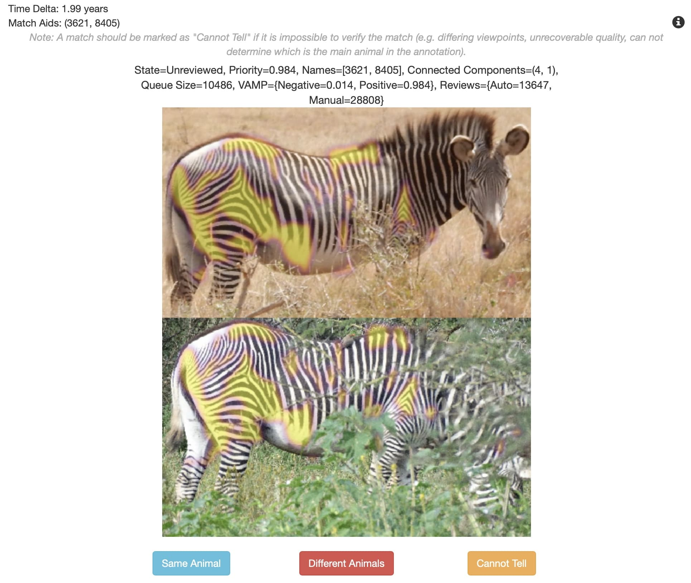

To start a custom ID curation process with LCA, use the following code to send a set of annotations from a Python embedded session to the web instance:

```python
import requests
import json

url = 'http://127.0.0.1:5000/review/identification/lca/refer/'  # Use within the Docker container

aids = [1]  # Get your list of annotation IDs
data = {
    'aids': aids,
}

data_ = {}
for key in data:
    data_[key] = json.dumps(data[key])

response = requests.post(url, data=data_)
```

To start an LCA instance manually, use the following code:

```python
from wbia_lca._plugin import LCAActor
actor = LCAActor()
result = actor.start(
    dbdir=ibs.dbdir, 
    aids=aids, 
    graph_uuid='11111111-1111-1111-1111-111111111111'
)
response = actor.resume()
```

If you wish to use the older Graph ID algorithm, it can be accessed using a slightly different referal link (which requires code changes):

    /review/identification/graph/refer/?imgsetid=1&option=census&species=zebra_grevys&backend=graph_algorithm

    or

    /review/identification/graph/refer/?imgsetid=1&option=census&species=zebra_grevys&backend=lca

A training video of how to review the matches, and what to look for, can be seen here: 

    https://drive.google.com/file/d/1Mj4Grd6zs_Rpha6-8ZdWu0uFenRqWO9e/view?usp=share_link

### Database Sanity Checks

**Encounter Singleton Validity**

After the ID database has been reviewed, one of the first steps is to review any encounter singletons (implicitly including any annotation singletons) to check for annotations that should have been filtered out during the detection stage.  This includes any annotations that were incorrectly included becuase they have a poor visual appearance, are too blurry, or any other visual occlusion that would interfere with the automated matching process.  Once any offending annotations are excluded, it is recommended to re-run the decision management algorithm to ensure that the graph is still consistent.

**ID-Based GPS Synchronization**

Using ``ibs.compute_ggr_fix_gps_names()`` will check for a spatiotemporal consistency between an animal and its various sightings.  This function can be handy to associate missing GPS information for an image that failed to synchronize during import.  The intuition is that if an animal is sighted at the same time by two cameras, and exactly one camera has GPS information, then the second camera can infer its missing GPS information.  This is not a check of ID errors, but rather a way to associate any missing GPS information prior to the speed check step.

**Animal Speed**

Likewise, an error may be found by checking the speed of animals over time.  It is recommended to manually review any zebra that walks faster than 10 km/h based on its sightings during the event.  Use the function ``ibs.get_name_speeds()`` to calculate the speed of an animal between signtings.

## Ecological Curation

### Age & Sex Review

Once curated IDs have been added to the database, the age and sex demographics information can be annotated by an expert with the following interface:

    /review/demographics/


## Population Estimate

### Lincoln-Petersen Index & Male/Female Ratios

```python
import numpy as np
import utool as ut
import datetime


def demographics(ibs, aid_list_count):
    nid_list_count_dup = ibs.get_annot_name_rowids(aid_list_count)
    nid_list_count = list(set(nid_list_count_dup))

    name_sex_list = ibs.get_name_sex(nid_list_count)
    name_age_months_est_mins_list = ibs.get_name_age_months_est_min(nid_list_count)
    name_age_months_est_maxs_list = ibs.get_name_age_months_est_max(nid_list_count)
    age_list = [[0, 0, 0, 0], [0, 0, 0, 0], [0, 0, 0, 0]]
    age_unreviewed = 0
    age_ambiguous = 0
    for nid, sex, min_ages, max_ages in list(zip(nid_list_count, name_sex_list, name_age_months_est_mins_list, name_age_months_est_maxs_list)):
        if len(set(min_ages)) > 1 or len(set(max_ages)) > 1:
            # print('[web] Invalid name %r: Cannot have more than one age' % (nid, ))
            age_ambiguous += 1
            continue
        min_age = None
        max_age = None
        if len(min_ages) > 0:
            min_age = min_ages[0]
        if len(max_ages) > 0:
            max_age = max_ages[0]
        # Histogram
        if (min_age is None and max_age is None) or (min_age is -1 and max_age is -1):
            # print('[web] Unreviewded name %r: Specify the age for the name' % (nid, ))
            age_unreviewed += 1
            continue
        if sex not in [0, 1]:
            sex = 2
            # continue
        if (min_age is None or min_age < 12) and max_age < 12:
            age_list[sex][0] += 1
        elif 12 <= min_age and min_age < 24 and 12 <= max_age and max_age < 24:
            age_list[sex][1] += 1
        elif 24 <= min_age and min_age < 36 and 24 <= max_age and max_age < 36:
            age_list[sex][2] += 1
        elif 36 <= min_age and (max_age is None or 36 <= max_age):
            age_list[sex][3] += 1

    DEMOGRAPHICS_INCLUDE_UNREVIEWED_AMBIGOUS = False
    age_total = sum(map(sum, age_list))
    if DEMOGRAPHICS_INCLUDE_UNREVIEWED_AMBIGOUS:
        age_total += age_unreviewed + age_ambiguous
    age_total = np.nan if age_total == 0 else age_total
    age_fmt_str = (lambda x: '% 4d (% 2.02f%%)' % (x, 100 * x / age_total, ))
    age_str_list = [
        [
            age_fmt_str(age)
            for age in age_list_
        ]
        for age_list_ in age_list
    ]
    age_str_list.append(age_fmt_str(age_unreviewed))
    age_str_list.append(age_fmt_str(age_ambiguous))

    return age_str_list, age_total


def sight_resight_count(nvisit1, nvisit2, resight):
    r"""
    Lincoln Petersen Index

    The Lincoln-Peterson index is a method used to estimate the total number of
    individuals in a population given two independent sets observations.  The
    likelihood of a population size is a hypergeometric distribution given by
    assuming a uniform sampling distribution.

    Args:
        nvisit1 (int): the number of individuals seen on visit 1.
        nvisit2 (int): be the number of individuals seen on visit 2.
        resight (int): the number of (matched) individuals seen on both visits.

    Returns:
        tuple: (pl_index, pl_error)
    """
    import math
    try:
        nvisit1 = float(nvisit1)
        nvisit2 = float(nvisit2)
        resight = float(resight)
        pl_index = int(math.ceil( (nvisit1 * nvisit2) / resight ))
        pl_error_num = float((nvisit1 ** 2) * nvisit2 * (nvisit2 - resight))
        pl_error_dom = float(resight ** 3)
        pl_error = int(math.ceil(1.96 * math.sqrt(pl_error_num / pl_error_dom)))
    except ZeroDivisionError:
        # pl_index = 'Undefined - Zero recaptured (k = 0)'
        pl_index = 0
        pl_error = 0
    return pl_index, pl_error


def estimate_twoday_count(ibs, imageset_id, day1, day2, filter_kw):
    # gid_list = ibs.get_valid_gids()
    if imageset_id is None:
        all_images = ibs.images()
        print('Location: National')
    else:
        imageset = ibs.imagesets([imageset_id])
        all_images = imageset.images[0]
        imageset_text = ibs.get_imageset_text([imageset_id])
        imageset_text = imageset_text[0]
        imageset_text = imageset_text.split('GGR Special Zone - ')
        imageset_text = imageset_text[1]
        imageset_text = imageset_text.strip()
        print('Location: %s' % (imageset_text, ))

    dates = [dt.date() for dt in all_images.datetime]
    date_to_images = all_images.group_items(dates)
    date_to_images = ut.sort_dict(date_to_images)
    #date_hist = ut.map_dict_vals(len, date2_gids)
    #print('date_hist = %s' % (ut.repr2(date_hist, nl=2),))
    verbose = 0

    visit_dates = [day1, day2]
    visit_info_list_ = []
    aids_ = []
    for day in visit_dates:
        images = date_to_images.get(day, None)
        if images is None:
            continue
        aids = ut.flatten(images.aids)
        aids = ibs.check_ggr_valid_aids(aids, species='zebra_grevys', threshold=0.75)
        # aids = ibs.check_ggr_valid_aids(aids, species='giraffe_reticulated', threshold=0.75)

        aids_ += aids
        nids = ibs.get_annot_name_rowids(aids)
        grouped_aids = ut.group_items(aids, nids)
        unique_nids = ut.unique(list(grouped_aids.keys()))

        if False:
            aids_list = ut.take(grouped_aids, unique_nids)
            for aids in aids_list:
                if len(aids) > 30:
                    break
            timedeltas_list = ibs.get_unflat_annots_timedelta_list(aids_list)
            # Do the five second rule
            marked_thresh = 5
            flags = []
            for nid, timedeltas in zip(unique_nids, timedeltas_list):
                flags.append(timedeltas.max() > marked_thresh)
            print('Unmarking %d names' % (len(flags) - sum(flags)))
            unique_nids = ut.compress(unique_nids, flags)
            grouped_aids = ut.dict_subset(grouped_aids, unique_nids)

        unique_aids = ut.flatten(list(grouped_aids.values()))
        info = {
            'unique_nids': unique_nids,
            'grouped_aids': grouped_aids,
            'unique_aids': unique_aids,
        }
        visit_info_list_.append(info)

    nids_ = ibs.get_annot_name_rowids(aids_)
    nids_ = set(nids_)
    aids_list = ibs.get_name_aids(nids_)
    len_list = np.array(list(map(len, aids_list)))
    # print(len_list.min())
    # print(len_list.max())
    # print(len_list.mean())
    # print(len_list.std())

    # Estimate statistics
    from ibeis.other import dbinfo
    try:
        aids_day1, aids_day2 = ut.take_column(visit_info_list_, 'unique_aids')
    except ValueError:
        aids_day1, aids_day2 = [], []
    try:
        nids_day1, nids_day2 = ut.take_column(visit_info_list_, 'unique_nids')
    except ValueError:
        nids_day1, nids_day2 = [], []

    resight_nids = ut.isect(nids_day1, nids_day2)
    nsight1 = len(nids_day1)
    nsight2 = len(nids_day2)
    resight = len(resight_nids)
    lp_index, lp_error = sight_resight_count(nsight1, nsight2, resight)

    if False:
        from ibeis.other import dbinfo
        print('DAY 1 STATS:')
        _ = dbinfo.get_dbinfo(ibs, aid_list=aids_day1)  # NOQA
        print('DAY 2 STATS:')
        _ = dbinfo.get_dbinfo(ibs, aid_list=aids_day2)  # NOQA
        print('COMBINED STATS:')
        _ = dbinfo.get_dbinfo(ibs, aid_list=aids_day1 + aids_day2)  # NOQA

    # print('%d annots on day 1' % (len(aids_day1)) )
    # print('%d annots on day 2' % (len(aids_day2)) )
    print('\tAnimals Seen: %d' % (nsight1 + nsight2 - resight, ))
    print('\tAnimals Seen on Day 1: %d' % (nsight1,))
    print('\tAnimals Seen on Day 2: %d' % (nsight2,))
    print('\tAnimals Resighted: %d' % (resight,))
    print('\tLincoln-Peterson Index: %d ± %d' % (lp_index, lp_error))

    values = demographics(ibs, aids_)
    age_str_list, age_total = values

    print('\tDemographics')
    print('\t\t Female ( 0-12): %s' % (age_str_list[0][0], ))
    print('\t\t Female (12-24): %s' % (age_str_list[0][1], ))
    print('\t\t Female (24-36): %s' % (age_str_list[0][2], ))
    print('\t\t Female (36+  ): %s' % (age_str_list[0][3], ))
    print('\t\t')
    print('\t\t   Male ( 0-12): %s' % (age_str_list[1][0], ))
    print('\t\t   Male (12-24): %s' % (age_str_list[1][1], ))
    print('\t\t   Male (24-36): %s' % (age_str_list[1][2], ))
    print('\t\t   Male (36+  ): %s' % (age_str_list[1][3], ))
    print('\t\t')
    print('\t\tUnknown ( 0-12): %s' % (age_str_list[2][0], ))
    print('\t\tUnknown (12-24): %s' % (age_str_list[2][1], ))
    print('\t\tUnknown (24-36): %s' % (age_str_list[2][2], ))
    print('\t\tUnknown (36+  ): %s' % (age_str_list[2][3], ))
    print('\t\t')
    print('\t\t     Unreviewed: %s' % (age_str_list[3], ))
    print('\t\t      Ambiguous: %s' % (age_str_list[4], ))
    print('\t\t----------------')
    print('\t\t          TOTAL: %s' % (age_total, ))

    return nsight1, nsight2, resight, lp_index, lp_error


day1 = datetime.date(2018, 1, 27)
day2 = datetime.date(2018, 1, 28)

imageset_id_list = ibs.get_valid_imgsetids()
imageset_text_list = ibs.get_imageset_text(imageset_id_list)
value_list = list(zip(imageset_text_list, imageset_id_list))
value_list = sorted(value_list)
imageset_text_list = [value[0] for value in value_list]
imageset_id_list = [value[1] for value in value_list]

imageset_id_list = [None] + imageset_id_list

for imageset_id in imageset_id_list:
    x = estimate_twoday_count(ibs, imageset_id, day1, day2, None)
    print('\n')
```

The function ``wbia/unstable/old_dbinfo_dan.py::estimate_ggr_count`` can also be used to calculate the Petersen-Lincoln Index and other population statistics.

### Generating Maps & Plots

The generation of maps and additional plots are done by the web browser.  The map is rendered using Google Maps and all of the routes for these interfaces are below:

*  ``/view/map/``
*  ``/view/advanced/0/``
*  ``/view/advanced/1/``
*  ``/view/advanced/2/``
*  ``/view/advanced/3/``
*  ``/view/advanced/4/``

### Export data

To export the GGR dataset, use the WBIA function ``ibs.export_ggr_folders()``

## Narrative Example

The purpose of this section is to provide a condensed walk-through of the most current, recommended process for animal photographic censusing.  As such, we can opt to rely on the pre-trained detection pipeline and advanced Census Annotation machine learning models that have been introduced.  What follows is an end-to-end analysis by following the steps listed in the process diagram (in the introduction) on a large animal population.

The population estimates from the GGR-16 and GGR-18 were a product of their respective times and the states of the computer vision algorithms available to them.  The field of computer vision has advanced drastically between then and now, with some of the components introduced in this thesis not even being available at the time of their original analysis.  However, to demonstrate the effectiveness of concepts like Census Annotations and the LCA curation algorithm, we wish to audit a GGR censusing event with modern tools.  The benefit of having photographic ID evidence for a population is that newer machine learning approaches can be evaluated for improvements in accuracy and human involvement.  This section performs a new, standalone analysis of the data collected by the GGR-18 photographic censusing event for Grevy's zebra.  This analysis focuses on the GGR-18 over the GGR-16 event because it is the most representative geographic sampling (covering the northern blocks) and is the active population estimate provided by the Kenyan government.

We processed all of the raw GGR-18 imagery fresh for an end-to-end run-through of the entire procedure.  We imported a total of 56,588 valid images and ran the automated detector pipeline on the images.  The localizer was configured using the pre-trained GGR-18 Grevy's zebra model and used an NMS threshold of 40% and an operating point of 40%.  The localization model produced 104,858 annotations, with 73,356 of those labeled with the generic ``zebra`` label.  Using a single NVIDIA Titan RTX and a 20-core server, the bounding box regression computation took approximately 6.5 hours.

The GGR-18 census event asked volunteers to take right-side shots of Grevy's zebra, so we need to use the labeler network to filter out other species (including plains zebra) and any viewpoints that did not show the right side.  The labeler was trained using a collection of Grevy's and Plains zebra data and various viewpoints.  The ``zebra_v1`` model (an ensemble of DenseNet-style neural networks) was configured such that the most confident ``species:viewpoint`` prediction that was returned was used as the final label.  The labeler computed results on the same accelerator hardware in approximately 5.5 hours.  The labeler produced a classification of ``zebra_grevys`` for 67,409 annotations, but approximately half of those showed the incorrect viewpoint.  The algorithm predicted 23,458 ``right``, 8,735 ``front-right``, and 8,273 ``back-right`` viewpoints labels; all annotations that were not Grevy's zebra or that did not show the right side were discarded, leaving 37,199 for further processing.  These annotations were sourced from 20,015 original images.

Next, the ``V4`` CA classifier was run on these images to identify the most likely Census Annotations for ID.  The inference ran for 1 hour and 40 minutes and produced a set of 15,072 Census Annotations (threshold = 0.31).  For reference, using a CA classifier threshold of 0.1 results in 16,848 annotations while using 0.9 ends with 11,381. Thus, using the recommended threshold of 0.31 keeps the majority of the borderline CAs. Next, each CA was passed to the CA Region regression network, which took 42 minutes to compute.  Once the bounding boxes were generated, we performed NMS (IoU = 1.0) to prevent overlapping CA Regions by suppressing the lower-scoring box as determined by the CA classifier.  The purpose of using an IoU of 100% was to guarantee zero overlap between annotations within an image, drastically reducing the incidence rate of mother-foal photobombs.  This filtering resulted in 14,742 Census Annotation Regions for right-side Grevy's zebras; these annotations were sourced from 12,772 images, indicating a utility rate of the citizen science capture of 22.6%.

Next, we synchronized all of the GPS locations and timestamps for all of the images (and source cameras) for these Census Annotation Regions.  All annotations taken outside the GGR-18 date range (Day 1: 1/27/2018 and Day 2: 1/28/2018) were discarded.  The standard GPS synchronization step was delayed until now to focus on only the images that contributed useful Census Annotation Regions.  There were 7,737 annotations taken on Day 1 and 6,116 on Day 2, coming from 11,991 images.  Additional filtering eliminated poor qualities based on pixel size, aspect ratio, and gradient magnitudes (blurriness).  While the CA classifier does an excellent job filtering out incomparable sightings, it still makes some mistakes.  Most of the CA classifier's mistakes come from blurry annotations, and -- while they are subjectively challenging pairs and take humans a long time to decide -- they are comparable.  The average aspect ratio (height / width) was calculated and any box outside of 2.0 standard deviations was discarded (min = 0.328, max = 1.449, mean = 0.612, std = 0.109), removing 698 annotations.  A similar filter was applied to the total number of width and height pixels for each annotation.  An additional 281 annotations were removed (minimum width 245 pixels, minimum height 161 pixels) using a minimum threshold of the mean minus 1.5 standard deviations.  Lastly, we computed the average gradient magnitude across the image using an x-axis and y-axis Sobel filter (kernel size 3).  The average of the gradient magnitude mean for all annotations was calculated as 86.0 on *uint8* RGB 3-channel cropped chip with a maximum-linear dimension of 700 pixels (min = 12.8, max = 182.5, mean = 86.0, std = 27.9).  All annotations with a mean gradient less than 1.5 standard deviations under the average mean gradient (less than 44.2) were removed.  This left 11,916 annotations (Day 1: 6,677, Day 2: 5,239) and 10,558 images.  All other annotations and images that did not contain a Census Annotation Region or passed these photometric quality filters were discarded and not used for further analysis.  All processing up to this point has been completely automated.

Next, the LCA algorithm was initialized by loading a pre-trained weighter function.  The weighter was created from 500 positive and 500 negative pair decisions from the GZCD dataset.  Next, the match candidates were sampled using a HotSpotter rank list for all of the CA Regions (tuned for ``K=5``, ``Knorm=5``, ``n_top=10``, spatial verification was ON, scoring method ``csum``) that found 67,247 pairs.  The VAMP model trained on Grevy's zebra CA Regions was used as the verification algorithm and applied to all matching pairs.  In total, 13,848 negative weights, 10 neutral weights, and 53,389 positive weights were found by the VAMP verifier for LCA.  The LCA algorithm then proceeded to try alternative pairs of clusters, asking for VAMP and human decisions, as it worked.  The pairs that the algorithm wanted a human decision were given to a web interface and reviewed by the author.

In total, it took just under 12 hours for the LCA algorithm, working with a single human reviewer to converge.  The LCA process attempted 23,783 alternative clusterings and requested an additional 19,160 VAMP decisions during its automated processing.  The ID curation process required just 1,297 human decisions before converging.  For reference, the original GGR-18 analysis using the Graph ID algorithm required 18,556 human decisions.  The resulting ID database was then checked to ensure no erroneous IDs with poor singletons needed to be excluded (i.e., the detection pipeline failed to filter them out).  In total, 15 IDs were excluded for having too poor quality, leaving 2,022 unique IDs in the database.  The demographics labeling step was skipped, and the gender checks were not performed for the sake of a more straightforward verification, but the speed check resulted in zero IDs being marked for review.  A total of 1,338 individuals were seen on day 1, 1,326 animals were seen on day 2, and 642 animals were seen on both days. The final Lincoln-Petersen estimate using this new ID database was 2,764 +/- 154, consistent within 1.7% with the reported estimate on GGR-18 (2,812 +/- 171).  Furthermore, this result was 93% less human effort than the GGR-18 processing and was completed with the effort of a single working day for one person.  Using values for the Automated P-L index suggests a correction value of +56 IDs for the population estimate and a widening of +/- 13 for the confidence interval.  The final corrected population estimate with high degrees of automation is therefore 2,820 +/- 167 (0.3% off), compared to the originally reported estimate for GGR-18 of 2,812 +/- 171.

## Additional GGR Setup

### User Instruction Guide

The participating photographers were asked to go into an assigned survey area via car and capture images of the species of interest (i.e., Grevy's zebra and reticulated giraffe).  Prior to departing, each participant was given a training document and a Cheat Sheet that showed the common do's and dont's of a photographic collection.  For example, the participant training document given to participants of the GGR-18 includes instructions on how to set up the Nikon GPS-enabled cameras.  The participant instructions were updated slightly between the GZGC, GGR-16, and GGR-18 censusing events based on a better understanding of how the detection pipeline and ID systems were failing.  The training process created a feedback loop, where subtle differences in the training instructions influenced the quality of images collected.  For example, the GGR-18 training instructions encouraged the photographer to:

*  Pick a single subject (of the target species and target viewpoint),
*  Always take a picture of an animal in the foreground,
*  Place the subject in the center of the photograph, and
*  Zoom the camera such that the animal covers around 50% of the image (if possible).

All photographers for the GZGC were requested to take pictures of the left sides of plains zebras and Masai giraffes, while photographers for the GGR were requested to take pictures of the right sides of Grevy's zebras and reticulated giraffes.  Having a consistent viewpoint (left or right) allows for more effective sight-resight and reduces the chance of ML errors. Furthermore, the distinguishing visual markings for these species are not left-right symmetrical, so the animal's appearance differs (sometimes significantly) from side to side.  This asymmetry means that a right-only census must discard a left viewpoint sighting as irrelevant data.

Along with guidance on species, photographers were shown examples of good/poor quality photographs emphasizing

1.  the correct side of the animal,
2.  getting a large enough and clear view, and
3.  seeing the animal in relative isolation from other animals.

To better guarantee a valuable sighting, GGR photographers were requested to take about three pictures of the right side of each Grevy's zebra they saw.  In both the GZGC and GGR, photographers were invited to take other pictures once they had adequately photographed each encountered animal, causing miscellaneous photographs to be collected.  This decision was primarily to help minimize photographer fatigue and allow flexibility when an exciting or otherwise rare species was encountered.

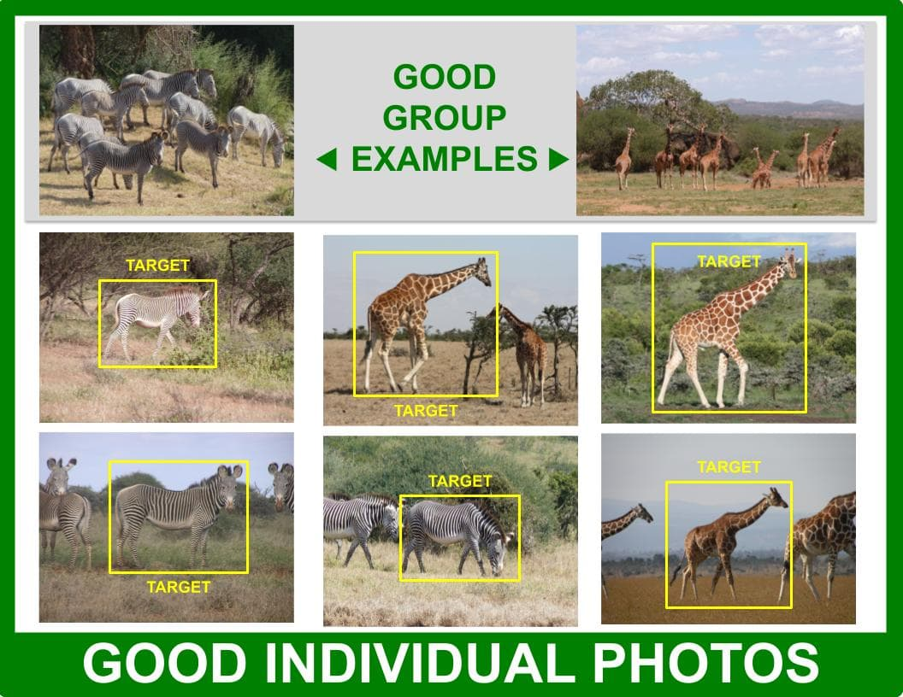
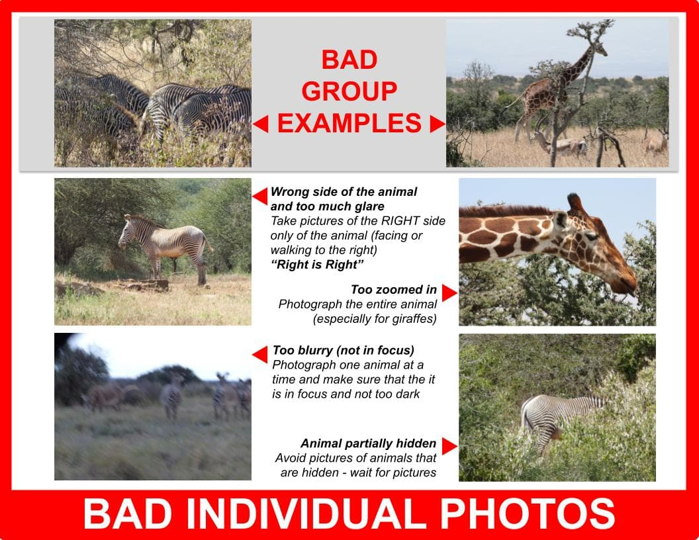

### QR Code Cards

Upon registering for the GGR-18 censusing rally, all participants were given a GPS-enabled camera and a paper "camera card".  This procedure is similar to the GZGC, except for how GPS locations were synchronized across cars.  During the GZGC, a dedicated GPS dongle was provided for each car, and participants could bring their cameras. Unfortunately, this open policy proved to be a synchronization challenge across multiple timestamp formats, failures to start GPS recording, and other miscellaneous inconsistencies or problems. As a result, the GGR-16 and GGR-18 procedures were improved to address these issues:

1.  A Nikon GPS-enabled camera was provided to every car that volunteered to take pictures for the rally.  This camera is always labeled with the letter ``A`` within the car. In addition, a GPS camera replaced the GPS dongle that was provided to every car during the GZGC.  All photographers' times of their photographs were assigned locations via a look-up table from the GPS log.
2.  A QR code was added to the camera card that provided a link to the Great Grevy's Rally (greatgrevysrally.com), which also embedded the car number and photographer letter into the URL.
3.  The "3-2-1 Snap" handout used during the GZGC was combined and consolidated with the camera cards.  For the GGR-16 and GGR-18, the "3-2-1 Snap" wording was added to the front side of the camera card, which was used to coordinate all photographers in a car.  Since at least one camera in the car was guaranteed to support GPS (and therefore has access to accurate timestamps), participants did not need to write down the local time.

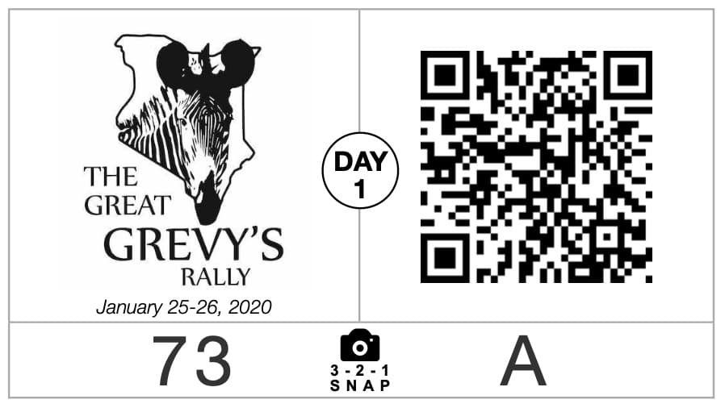
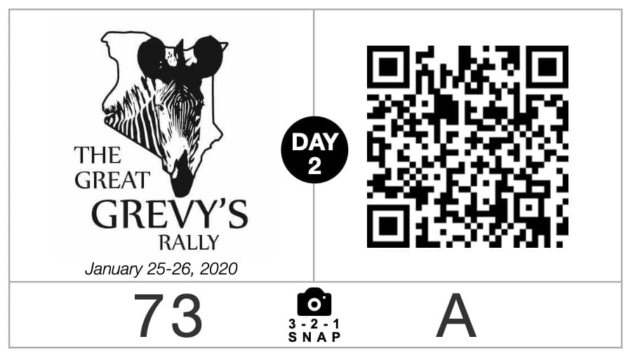

An example sync image of the camera card with QR code can be seen above.  During processing, the images were automatically scanned to find the QR code for each photographer in a car.  The timestamps of the QR code are associated with the correct timestamp provided by the GPS camera, which receives accurate date and time data from the orbiting satellites.  A given photographer's images were then assigned a "timedelta" (i.e., a time offset), which was used to correct their respective EXIF timestamps to local Kenya time.  Furthermore, there is a unique QR code for day 1 and day 2 of the census rally.  The second QR code and "3-2-1 Snap" image are used to cross-reference and check the timedelta calculation for a given photographer.  The benefit of using a separate QR code for days 1 and 2 is that it adds redundancy because some photographers forgot to take the image on either day.  In that event, the assumption is that the system clock of each participant's camera is at least internally consistent, so one timestamp is sufficient to establish the correction factor.

The code to generate the QR cards is located here: https://github.com/bluemellophone/city
